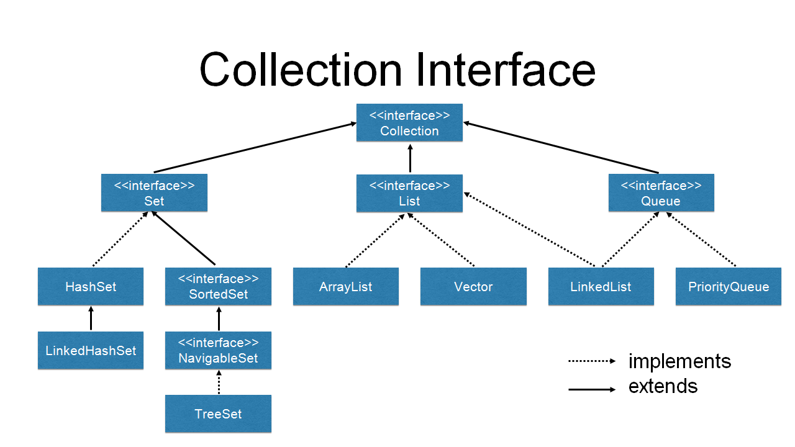

Table Of Contents
* [Overview Questions](#overview-questions)
+ [What is collections framework?](#what-is-collections-framework-)
+ [What are the benefits of collection framework?](#what-are-the-benefits-of-collection-framework-)
+ [What are the main interfaces of collection framework?](#what-are-the-main-interfaces-of-collection-framework-)
+ [Describe the collection api hierarchy](#describe-the-collection-api-hierarchy)
  - [Collection Implementation Details](#collection-implementation-details)
+ [What is the difference between Collection and Collections?](#what-is-the-difference-between-collection-and-collections-)
+ [What are the different ways to iterate over a collection?](#what-are-the-different-ways-to-iterate-over-a-collection-)
+ [Which collections classes provide random access of its elements?](#which-collections-classes-provide-random-access-of-its-elements-)
* [Collections Implementation Compraison](#collections-implementation-compraison)
+ [What is the difference between Array and Arraylist data structures?](#what-is-the-difference-between-array-and-arraylist-data-structures-)
+ [What is the difference between LinkedList and Arraylist data structures?](#what-is-the-difference-between-linkedlist-and-arraylist-data-structures-)
+ [What is the difference between Stack and Queue?](#what-is-the-difference-between-stack-and-queue-)
* [Illustrations](#illustrations)
  
# Java Collections Interview Questions

## Overview Questions

### What is collections framework?
It is a set of interfaces and classes that are used to store and process data in an effecient way.

It was introduces in JDK v1.2. 
Prior to that, Java had some utilisity classes for storing data like Vector and HashTable.

### What are the benefits of collection framework?

- Easy to learn and implement
- Reduces programming effort and time due to the ready to use code.
- Increases performance of app because of the high-performance implementations of data structures.

### What are the main interfaces of collection framework?

    1. Collection
    2. List
    3. Set
    4. Queue
    5. Map
    
### Describe the collection api hierarchy

Collection and Map are two root interfaces.

Collection interface is extended by Set, List and Queue interfaces.

Map interface represents group of object as key:value pairs. The keys are unique.

#### Collection Implementation Details

- List is a sub interface of Collection. It is extended by ArrayList, LinkedList and Vector classes.

- Set is a sub interface of Collection. It is extended by HashSet and SortedSet.

- Queue is a sub interface of Collection. It follows the First In First Out principle. It is extended by LinkedList and PriorityQueue. 

### What is the difference between Collection and Collections?

Collections is a class that provided utility methods for the Collection interface.

## Navigation and Sorting

### What are the different ways to iterate over a collection?

    1. Through loops
    2. Through cursors
        - Iterator
        - ListIterator
        - Enumeration

### How can we sort Collections?

- Using a datastructure that is made to store elements in a sorted order like TreeSet and TreeHashSe.
- Using Collections.sort to sort a list. 
  When using this, we can either use a comparator, 
  or use the compareTo method if object implements Comparable interface.
- Using streams

### Which collections classes provide random access of its elements?

ArrayList, Vector, Stack, HashMap, HashTable

public class ArrayList<E> extends AbstractList<E> implements List<E>, <b>RandomAccess</b>, ...
public class Vector<E> extends AbstractList<E> implements List<E>, <b>RandomAccess</b>, ...
public class Stack<E> extends <b>Vector<E></b>

HashMap used a HashTable as its underlaying data strucutre.
Hashtable uses array of buckets to store its elements.

### What is the difference between Collection remove() and Iterator remove()?

Collection's remove() allows us to remove an object while not iterating.

Iterator's remove() allows us to remove an object while iterating.

 
## Collections Implementation Compraison

### What is the difference between Array and Arraylist data structures?

    1. Array can contain primitive data types and objects, whereas Arraylist can only contain objects.
    2. Arrays are fixed in size, whereas Arraylist are dynamic.
    3. Arraylist has more methods to manipulate the data.
    
### What is the difference between LinkedList and Arraylist data structures?

    1. Their implemntaton structure:
        Arraylist is an index based data structure, built on top of a resisable array.
        Linkedlist is a node based data structure.
        
    2. Arraylist provides random access to its elements => O(1) to access an element.
       Whereas with a linkedlist the time complexity to access an element by index is O(n) 
       (since we have to iterate over the whole list).
       
    3. Linkedlist is faster in general to add or remove elements because no element shift is required. 
        We just have to insert a new node and update the pointers address accordingly.
        
    4. Linkedlist consumes more memory space because it has to store the reference of next element on every node.     

### What is the difference between Stack and Queue?

    1. Stack uses LIFO (Last In, First Out).
       Queue uses FIFO (First In, First Out).
    2. In a stack, elements are added to the beginning.
       In a queue, elements are added to the end.
       The methods used to manipilate a stack are push and pop.
       Queue has add and remove.       
    3. In Collection API, queue is a direct inteface of Collection., whereas stack is a class that implementes Vector.                  

### What is the difference between a List and Set 
    1. List allows duplicate elements. In contrast, a set does not.
    2. List preservs the order of insertion. In contrast, a set does not.
    
### What is the difference between HashSet, LinkedHashSet and TreeSet?

Ordering: 
    HashSet: maintains no order.

    LinkedHashSet: preserves the insersetion order.

    TreeSet: preserves sorting order.

Internal Implementation:
    HashSet is backed by HashMap.
    LinkedHashSet is implemented using HashSet and LinkedList.
    TreeSet is backed by navigable map and TreeMap.

Rapidity:
    Amongt the three, HashSet is the fastest.

Comparaison of Elements:
    HashSet and LinkedHashSet use equals() to compare elements.
    TreeSet uses compareTo().    

Insertion of Null elements:
    HashSet (and LinkedHashSet) allows the insertion of null elements.
    TreeSet does not (since the comparaison will resolve in a NPE).    
    
## Map Interface

### What is a HashMap?

### What is NavigableMap?

It is a direct child of SortedMap interface, and a descendent of Map interface. 
It contains methods related to navigation, like lowerKey and ceilingKey.

### What is the difference between HashMap and HashTable?

### Can we use a custo object as a key in a Map?

Yes we can. The object we want to use as key must override equals() and hashcode() for that.

### Why is it advisable to use an immutable object as key in a Map?

So that we can get back any value from the map using the key. If a key changes, 
then it will be impossible to get back the values. 

## Illustrations

Source: https://dzone.com/articles/an-introduction-to-the-java-collections-framework

Source: https://dzone.com/articles/an-introduction-to-the-java-collections-framework